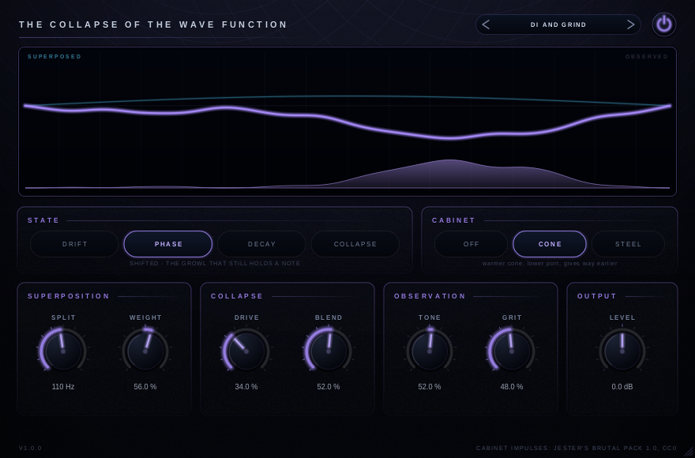
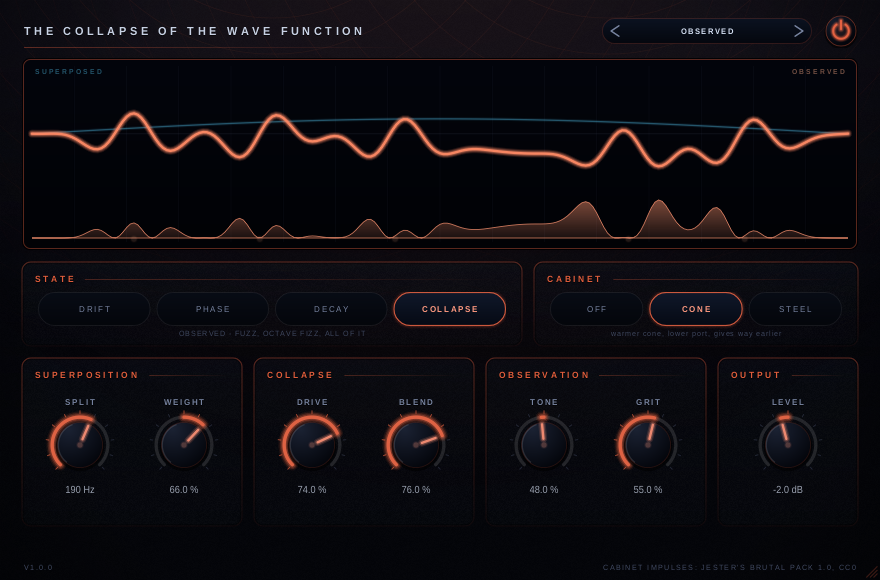

# The Collapse of The Wave Function

A bass drive that can be pushed a very long way without the note falling out from under
it. The bottom of the instrument is taken out of the drive path by a crossover, driven
nowhere, and put back afterwards — so Drive and Blend can go where they like and a low E
still arrives at the same level it left at.

VST3 and standalone, Linux and Windows.





The picture in the middle is the plug-in telling you what it is doing. A superposition of
standing modes while the signal is coherent; localised packets, and a row of spikes in the
probability strip along the floor, once the drive path has been observed. The cold ribbon
underneath is the band that never enters the drive path at all.

## Why the split

Distortion of two low fundamentals produces the sum and difference between them, and on a
bass those land in the middle of the note. Turn a fuzz up on a low E and the note does not
get dirty, it gets *smaller*.

So it is split first. Measured, with the crossover at 150 Hz and the Collapse voicing at
full Drive and full Blend:

| | Fundamental of a low E |
|---|---|
| **Split at 150 Hz** | **−0.9 dB** |
| Split at 20 Hz (no split) | −16.8 dB |

Both numbers come out of `devtool check`, which runs on every build.

Taking the low band away in front of the clipper is only half of it. Whatever residual
gets through is then handed up to 92 dB of gain, saturates, and comes back out as a
square wave with a fundamental of its own — arriving at the sum in whatever phase the
input filter left it in, and subtracting from the clean band it was supposed to leave
alone. That measured −4.2 dB before the drive path grew a matching high-pass on the way
out. Both filters are why the first number above is what it is.

## Controls

| Control | What it does |
|---|---|
| **Split** | The crossover, 20 Hz to 800 Hz. Everything below it stays clean no matter what Drive and Blend are doing. At 20 Hz there is effectively no low band and Blend becomes a plain parallel mix. |
| **Weight** | The output low end: the subsonic corner from 40 Hz down to 16 Hz, and a shelf at 92 Hz. Acts on the sum, so it still does something with the crossover parked at the bottom. |
| **Drive** | How hard the gain stages are hit. Only the band above Split ever reaches them. |
| **Blend** | Coherent to collapsed. The clean path is delayed by exactly the latency the oversampler reports, so this is a crossfade and not a comb filter. |
| **Tone** | A tilt from dark to bright across the collapsed path, hinged at 380 Hz. |
| **Grit** | Pick attack and fret noise, a narrow band around 2.3 kHz. Its zero is at 35 %, so most of the travel adds. |
| **Level** | Output trim, ±18 dB. |
| **State** | Four voicings for the drive path, below. |
| **Cabinet** | Off, Cone or Steel — on the collapsed path only. |

### The four states

| | Voicing |
|---|---|
| **Drift** | Two low-gain stages, gentle asymmetry, almost no voicing. At Drive 0 a clean bass preamp that rounds peaks; at Drive 100 still only a warm growl. |
| **Phase** | The workhorse. Enough asymmetry for a real second harmonic and a push at 430 Hz, so a low B reads as a note rather than as a rumble with fur on it. |
| **Decay** | Three stages, a firmer input, a harder knee. Percussive and mid-forward, tight enough that fast lines stay legible. |
| **Collapse** | Heavy asymmetry, a long knee, and a squaring term for the octave-up fizz. Squashy even at Drive 0 — Blend is what makes it usable on a bass at all. |

Drift, Phase and Decay are level-matched to within a few tenths of a dB across the whole
Drive knob and against each other, so State is a voicing decision and not a volume one.
Collapse is deliberately left about 1.3 dB high in its last quarter: the top of that knob
is meant to be another gear, and a gear exactly as loud as the one below it does not feel
like one. The numbers behind that come from `devtool sweep`.

### The cabinet

Both cabinets are measured impulse responses from the midrange up, and a model below it.

The measurements are from Jester's Brutal Pack (CC0) — a guitar 4×12, which has
essentially nothing under 80 Hz. Rather than boost 30 dB of nothing, the low end is a
parallel band taken from the cabinet's own input, low-passed at fourth order and given the
port resonance a ported bass cabinet has. **Cone** is a Celestion V30 pair with a lower
port and a cone that gives way earlier; **Steel** is an Eminence DV-77 pair, stiffer and
tighter. Both are trimmed to unity across 150 Hz – 5 kHz, so reaching for a cabinet is not
also reaching for a volume control (measured: within 1.2 dB of Off, and of each other).

In front of the linear part sits a level-dependent cone: excursion compresses the bass and
voice-coil heating pulls sustained level down, both driven from a low-passed displacement
signal so the non-linearity cannot generate anything high enough to alias.

The cabinet only ever sees the collapsed path. That is how the rig this imitates is
wired — a DI holding the bottom, a driven amp holding the shape — and it means the
modelled low end never has to fight the real one coming down the clean side.

## What it does not claim

At Blend 0 the frequency response is flat to within 0.2 dB from 60 Hz to 10 kHz, but the
output is **not** bit-identical to the input: a Linkwitz-Riley crossover summed back
together is an allpass, so the phase is rotated around the crossover point. Inaudible on
its own; against a parallel untouched copy of the same take it will comb, exactly as an
analogue crossover would.

Latency is 32 samples at 48 kHz (48 at 96 kHz and above), reported to the host, and bypass
is delayed to match — measured at −100 dBFS of error, which is the float noise floor.

## Installing

Download and unpack the archive from the
[latest release](https://github.com/doctorspider42/the-collapse-of-the-wave-function/releases/latest).

- **Linux:** copy `The Collapse of The Wave Function.vst3` to `~/.vst3/`
- **Windows:** copy it to `C:\Program Files\Common Files\VST3\`

The binary of the same name in the archive is the standalone application and needs nothing
installing.

## Building

Requires Git, CMake 3.22+, a C++17 compiler and the usual JUCE platform dependencies. On
Windows use Visual Studio 2022 with the Desktop C++ workload.

```bash
git clone --recurse-submodules https://github.com/doctorspider42/the-collapse-of-the-wave-function.git
```

```bash
cd the-collapse-of-the-wave-function && ./build.sh --run
```

`build.sh` configures, builds, runs the offline checks and can start the standalone.
`--shot` renders the panel, `--sweep` re-measures the level curves behind `Shapers.h`, and
`--cab` prints the cabinet's magnitude response.

## Verifying it

Everything the sections above claim is checked by `devtool check`, which needs no host, no
audio device and no display, and runs in about a minute:

```bash
./build/CollapseDevTool_artefacts/Release/CollapseDevTool check
```

It asserts the crossover sums flat, that the fundamental survives full Collapse fuzz and
that it does not without the split, that every one of the nine controls changes the output,
that bypass nulls against the reported latency, that silence stays silent through two
asymmetric shapers and a squaring term, that nothing goes unbounded or non-finite at any
setting, that the cabinets are level-matched and keep their bottom octave, that aliasing
stays below −45 dB at full drive, and that switching state, cabinet, crossover and sample
rate mid-stream stays finite. It then prints the CPU cost.

CI runs the same binary on Linux and Windows, renders the panel headlessly, and puts
pluginval at strictness 8 over the VST3 before anything is published.

## Licence

GPLv3-or-later. It links JUCE 8 under the AGPLv3, so every distributed binary additionally
carries AGPLv3 section 13 — both texts ship in `LICENSE` and `LICENSE.AGPLv3`, and every
release archive carries a `BUILD-INFO.txt` naming the commit and the exact JUCE revision it
was built against. Third-party components and their licences are listed in
[NOTICE.md](NOTICE.md).
